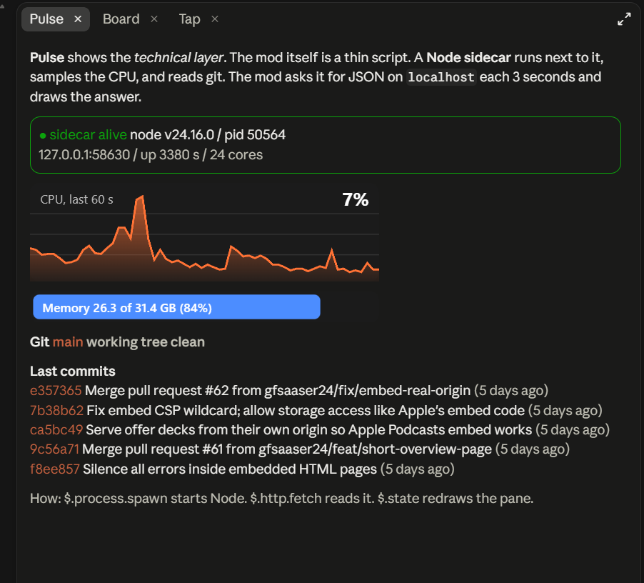
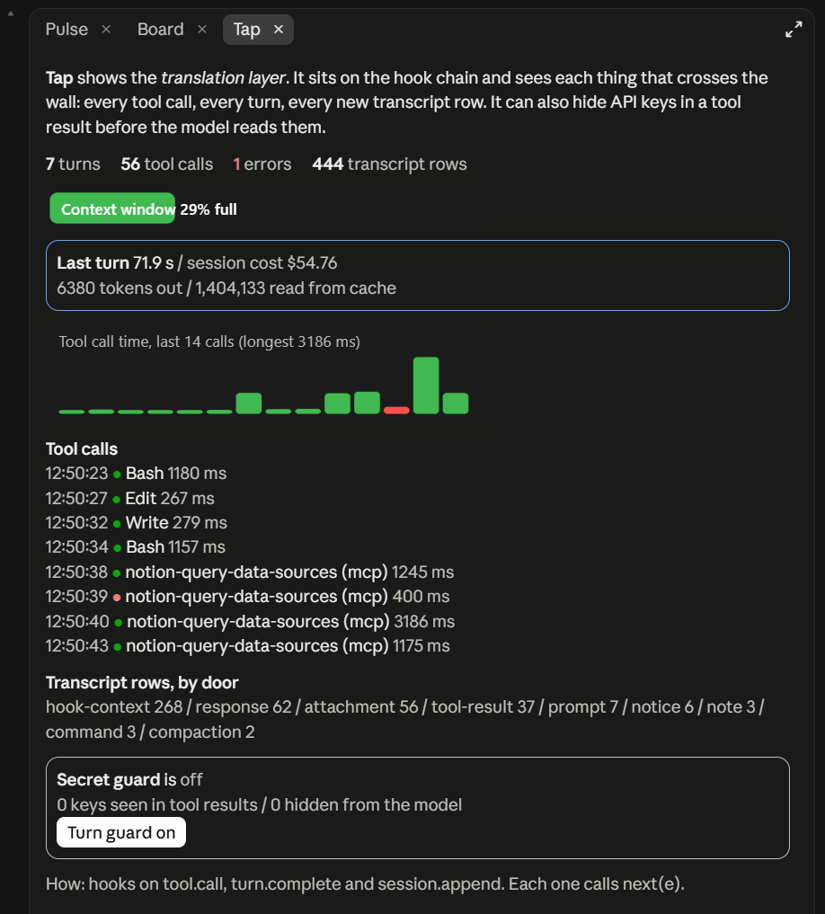
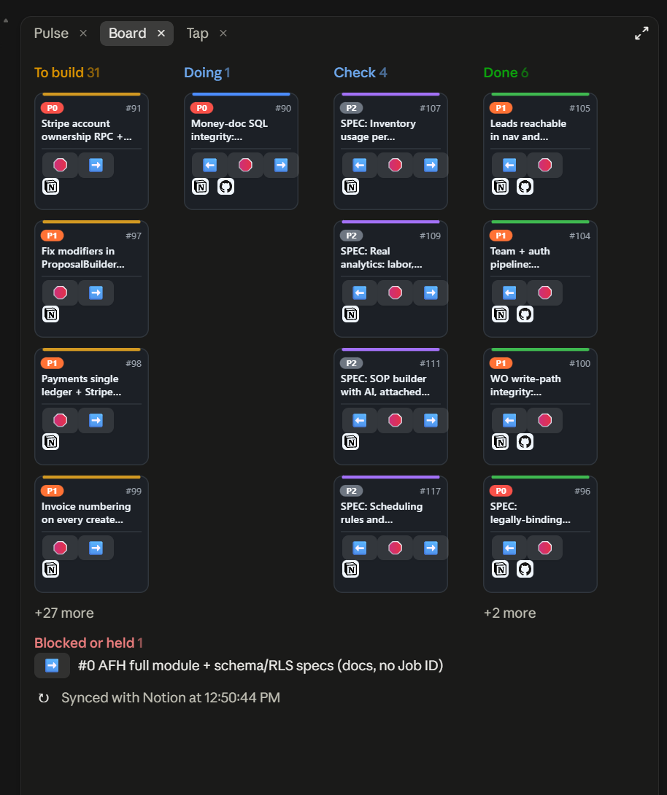

# Claude Code mod examples

Three working mods for the Claude Code mod system. Each one shows one layer of it.

The long write-up is here: [What Claude Code mods can and cannot do](https://gist.github.com/gfsaaser24/069662e26e9cacf600a84521fed30886).

| Mod | Layer | What it shows |
| --- | --- | --- |
| [`pulse`](pulse) | Technical | A Node sidecar next to a sealed mod. The mod talks JSON to it over `localhost`. |
| [`tap`](tap) | Translation | Hooks on the chain between you and the model. It records what crosses, and it can hide keys. |
| [`board`](board) | Front end | A Notion kanban. SVG draws the cards. Real buttons and links sit on top. |

## Pulse



The mod itself can't read the CPU or run git. It lives in a sealed worker with no Node. So it starts a small Node server with `$.process.spawn`, then asks it for JSON every 3 seconds with `$.http.fetch`. The chart and the memory bar are SVG strings.

Read [`pulse/hooks/register.tsx`](pulse/hooks/register.tsx) and [`pulse/sidecar/server.mjs`](pulse/sidecar/server.mjs).

## Tap



Tap hooks `tool.call`, `prompt.submit`, `session.append` and `turn.complete`. Every hook calls `next(e)`, so nothing changes for the model unless you turn the secret guard on. With the guard on, key-shaped strings in a tool result are swapped for a mask before the model reads them.

Read [`tap/hooks/register.tsx`](tap/hooks/register.tsx).

## Board



Board reads a Notion database through `$.mcp.call` and draws one SVG per card. A click inside an SVG never reaches a mod, so the arrows are real `Button`s laid over the card with `position="absolute"`, and each logo has a `Link` laid over it. The arrows write the new status back to Notion.

Board needs 2 values from you, at the top of [`board/hooks/register.tsx`](board/hooks/register.tsx):

- `NOTION`: the id of your Notion connector.
- `SOURCE`: the `collection://` id of your database.

The database needs these columns: `Name`, `Workstream` (status), `Priority`, `Owner`, `PR`, `Job ID`. Change `FLOW` to match your own status names. With no ids set, the pane shows a "Load sample cards" button, and sample cards never write to Notion.

## Setup

### 1. What you need

- Claude Code 2.1.286 or later. Check with `claude --version`.
- Node on your `PATH`. Only Pulse needs it, for its sidecar.
- A Notion connector in Claude Code. Only Board needs it.

### 2. Get the code

```bash
git clone https://github.com/gfsaaser24/claude-code-mod-examples.git
```

```bash
cd claude-code-mod-examples
```

### 3. Read the mod, then check it

Open `hooks/register.tsx` in the mod you want. Then run the validator:

```bash
claude plugin validate ./pulse
```

A pass with warnings is normal.

### 4. Start Claude Code with the mod

```bash
claude --plugin-dir ./pulse
```

Use `./tap` or `./board` for the other two. The pane opens when the session starts. If you close it, type `/pulse`, `/tap` or `/board` to open it again.

SVG shows only in the desktop app. In a terminal, Tap and Board fall back to text, and Pulse shows its numbers with no chart.

### 5. Board only: point it at your Notion database

Board ships with placeholder ids, so it starts with a "Load sample cards" button. Sample cards never write to Notion. To use your own data:

1. Find your Notion connector id. Ask Claude Code: "List your Notion tool names." The names look like `mcp__<id>__notion-fetch`. The `<id>` part is the value for `NOTION`.
2. Find your database id. Ask Claude Code: "Fetch this Notion database and give me its collection:// id", and paste the database link. The answer looks like `collection://xxxxxxxx-...`. That is the value for `SOURCE`.
3. Put both values at the top of [`board/hooks/register.tsx`](board/hooks/register.tsx).
4. Make sure the database has these columns: `Name`, `Workstream` (the status), `Priority` (`P0`, `P1`, `P2`), `Owner`, `PR` (a URL), `Job ID` (a number).
5. Change `FLOW`, `SHORT` and `PARKED` in the same file to match your own status names.

After that, the arrows change the status of the real Notion page. There is no confirm step.

### 6. Test a mod

```bash
claude plugin test ./board
```

Each mod has a test that mounts its pane on the desktop and terminal surfaces. Board also has one that presses the buttons on the sample cards.

## If something is wrong

- **The pane is blank.** One bad prop makes the engine refuse the whole tree, and it says nothing. Run `claude plugin test` on the mod to see the reason.
- **Pulse does not show "sidecar alive".** Check that `node` runs from the folder where you started Claude Code.
- **Board says "Could not read Notion".** The `NOTION` or `SOURCE` value is wrong, or the connector is not signed in.

## Before you run these

A mod runs as you. It can start processes, call the network, and call your connectors with no prompt. Read the hooks file before you run it. That goes for these 3 as well.

Tested on Claude Code 2.1.286 and 2.1.289, Windows. The mod system is new and it will change.
